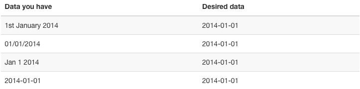
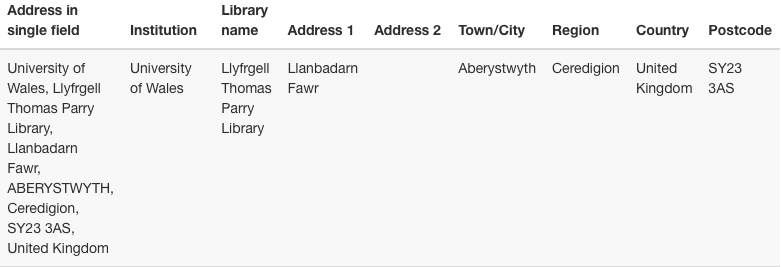
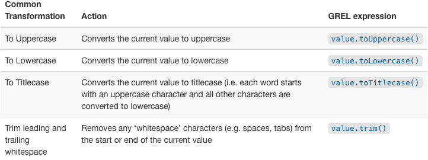

# Working with Messy Data
## Cleaning Data in OpenRefine

 
 
<b>David Durden</b>, Data Services Librarian 
<b>Jodi Coalter</b>, Life Sciences Librarian 
 
February 04, 2020

## Agenda and Topics

- Overview of the OpenRefine Application
- Loading data
- Performing data operations in OpenRefine
- Creating workflow scripts
- Format conversion
- Saving data

# Files and Links

**Download Open Refine for your machine:** [https://openrefine.org/download.html]()

**Useful GREL Cheat Sheet:** [Cheat Sheet](assets/GoogleRefineCheatSheet.pdf)

**Data for lesson/exercises:** [Data](data/doaj-article-sample.csv)

# What is OpenRefine?

>OpenRefine is a browser-based graphical application for working with structured data.

- 'A tool for working with messy data'
- Works best with data in a simple tabular format
- Can help split data up into more granular parts
- Can help match local data up to other data sets
- Can help enhance a data set with with data from other sources

## Scenario: Date Formats

>When you have a list of dates which are formatted in different ways, and want to change all the dates in the list to a single common date format. For example:

## Scenario: Multiple Elements in a Single Field

>Sometimes multiple elements end up in a single cell. 

For example, an address field (in the first column). Each part of the address could be in a separate field:

# Let's Load Some data

Save a copy of this [csv](data/doaj-article-sample.csv). We'll use this file for the rest of the lesson (*it's also the same file listed earlier!*).

>You can upload or import files in a variety of formats including:

- TSV
- CSV
- Excel
- JSON
- XML
- Google Spreadsheet

## Create your First Project

>**NOTE**: If OpenRefine does not open in a browser window, open your browser and type `http://127.0.0.1:3333/` to take you to the OpenRefine interface.

1. Click `Create Project` from the left hand menu and select `Get data from This Computer`
2. Click `Choose Files` (or 'Browse') and locate the file which you have downloaded called `doaj-article-sample.csv`
3. Click `Next >>` - the next screen gives you options to ensure the data is imported correctly. The options vary depending on the type of data you are importing.
4. Click in the `Character encoding` box and set it to `UTF-8`
5. Ensure the first row is used to create the column headings by checking `Parse next 1 line(s) as column headers`
6. Make sure the `Parse cell text into numbers, dates, ...` box is not checked so OpenRefine doesn't try to automatically detect numbers
7. The Project Name box in the upper right corner will default to the title of your imported file. Click in the `Project Name` box to give it a different name.
8. Click `Create Project >>` at the top right of the screen. This will create the project and open it for you. Projects are saved as you work on them, so there is no need to save copies as you go along.

## The Layout of OpenRefine

>OpenRefine displays data in a tabular format. As with a spreadsheet, the individual bits of data live in ‘cells’ at the intersection of a row and a column.

>OpenRefine only displays a limited number of rows of data at one time. You can adjust the number choosing between 5, 10 (the default), 25 and 50 at the top left of the table of data.

>Most options to work with data in OpenRefine are accessed from drop down menus at the top of the data columns. When you select an option in a particular column (e.g. to make a change to the data), it will affect all the cells in that column, but only that column.

## Rows vs. Records

>OpenRefine has two modes of viewing data: ‘Rows’ and ‘Records’. At the moment we are in Rows mode, where each row represents a single record in the data set - in this case, an article. In Records mode, OpenRefine can link together multiple rows as belonging to the same Record.

# Basic Data Operations

## Splitting Cells

>To see how this works in practice, we'll use the Author column. You should be able to see multiple names in each cell separated by the pipe symbol ( \| ).

If we want to work with each author name individually, we need to have each name in its own cell. To split the names into their own cells, we can use a `Split multi-valued cells` function:

- Click the dropdown menu at the top of the Author column
- Choose `Edit cells -> Split multi-valued cells`
- In the prompt type the ( \| ) symbol and click `OK`
    - Note that the rows are still numbered sequentially
- Click the `Records` option to change to Records mode
    - Note how the numbering has changed - indicating that several rows are related to the same record

## Joining Cells

A common workflow with multi-valued cells is:

- Split multi-valued cells into individual cells
- Modify/refine/clean individual cells
- Join multi-valued cells back together

Modifying cells will be covered later, but for now we will join the cells back together.

- Click the dropdown menu at the top of the Author column
- Choose `Edit cells -> Join multi-valued cells`
- In the prompt type the ( \| ) 'pipe' symbol
    - Here we are specifying the *delimiter* character for OpenRefine to use to join the values together
- Click `OK` to join the Authors cells back together

>You will now see that the split rows have gone away - the Authors have been joined into a single cell with the specified delimiter. 

Our Rows and Records values will now be the same since we do not have any more columns with split (multi-valued) cells.

- Click both the `Rows` and `Records` options and observe how the numbers of Rows and Records are equal.

## Choosing a Good Separator

>The value that separates multi-valued cells is called a separator or delimiter. In the examples, we've seen the pipe character ( \| ) has been used.

Choosing the wrong separator can lead to problems. Consider the following multi-valued Author example with a pipe as a separator.

>`Jones, Andrew | Davis, S.`

When we tell OpenRefine to split this cell on the pipe ( \| ), we will get two separate authors.

Now imagine that the document creator has chosen a **comma** as the separator instead of a pipe.

>`Jones, Andrew, Davis, S.`

> Can you spot the problems? Can you tell where one author stops and the next begins?

> OpenRefine will split on **every** separator it encounters, so we'll end up with 4 authors, not two. We will get four "authors" because there are 3 commas separating the names.

- **Author 1:** Jones
- **Author 2:** Andrew
- **Author 3:** Davis
- **Author 4:** S.

Splitting on a comma will not work with Authors because the names may include commas within them.

>When creating a spreadsheet with multi-valued cells, choose a separator that will never appear in the cell values themselves. Commas, colons, and semi-colons should be avoided as separators.

# Exercise: Splitting the 'Subjects' Column

1. What separator character is used in the **Subjects** cells?
2. How would you split these subject words into individual cells?

    
Solution

    <ol>
        <li>The subject words/headings are delimited with the pipe ( | ) character.</li>
    <li>To split the subject words into individual cells you need to:
        <ul>
            <li>Click the drop-down menu at the top of the Subjects column</li>
            <li>Choose `Edit cells -> Split multi-valued cells`</li>
            <li>In the prompt, type the ( | ) character and click OK</li></ul></li></ol>

# Exercise: Join the 'Subjects' Column Back Together

1. Using what we've learned join the Subjects back together.

    
Solution

    <ol>
        <li>The subject words/headings were previously delimited with the pipe ( | ) character.</li>
        <li>To join the split subject cells back into a single cell you need to:
            <ul>
                <li>Click the dropdown menu at the top of Subjects column</li>
                <li>Choose `Edit cells -> Join multi-valued cells`</li>
                <li>In the prompt type the ( | ) character and click OK</li></ul></li></ol>

## Faceting and Filtering

> What is a facet?

Facets provide methods for both getting an overview of the data and to improve the consistency of the data.

>Facets work by grouping all like values that appear in a column.

The simplest type of fact is called a **'Text facet'**. This groups all the text values in a column and lists each value with the number of records/rows it appears in.

To create a **Text Facet** for a column, click on the drop-down menu at the top of the Publisher column and choose `Facet -> Text Facet`.

>You can use a facet to filter the data displayed by clicking on one of these headings.

Use the `Include` option to view the results of a facet. **Hint: hover over the facet value to see the `Include` option.**

You can include multiple values from the facet in a filter at one time by using the `Include` option which appears when you put your mouse over a value in the facet.

## Let's Create a Text Facet

1. From the Publisher column drop-down, choose `Facet -> Text Facet`. The facet will then appear in the left hand panel.
2. To select a single value, click the relevant line in the facet.
3. To select multiple values click the `Include` option on the appropriate line in the facet (which only appears when you mouse over the line).
4. You can 'invert' your selections to exclude data from view.
5. Include a value and then look at top to invert inclusion. 

## Exercise: Text Facets

>Which licenses are used for articles in this file?

Use a `text facet` for the `license` column and answer these questions?
1. What is the most common license in the file?
2. How many articles in the file don't have a license assigned?

Solution
<ol><li>Create a facet for the License column</li><li>Sort values by `count`</li><li>What is the most common License in the file? <b>Answer:</b> `CC BY`</li><li>How many articles in the file don't have a license assigned? <b>Answer:</b> `6`</li></ol>

## Text Filters

> What is a filter?

**Text Filters** query the text of column and return a result if there is a match. Text filters are applied by clicking the drop down menu at the top of the column you want to apply the filter to and choosing `Text filter`.

>The text filter works a lot like a search box.

**Tip: If you know regular expressions, you can also use them in a text filter.** [Relevant xckd](https://xkcd.com/208/)

## Working with Filtered and Faceted Data

>When you have filtered the data in OpenRefine, any operations you carry out will apply only to the rows that match the filter.

## Exercise: Facets

> Use the `Facet by blank` function to find all publications in this data set without a DOI

Solution
<ol><li>On the `DOI` column drop-down, select `Customized facets -> Facet by blank`</li><li>`True` means that it is blank, so you can:<ul><li>Select `Include` on `True` in the facet to filter the list of publications to only those that don't have a DOI</li></ul></li></ol>

## Editing Data through Facets

>You can use a facet to 'subset' your data and the value for several records simultaneously. To do this, mouse-over the facet value you want to edit and click the `edit` option that appears.

This approach is useful in relatively small facet results.

* Punctuation errors
* Misspellings
* Restricted or limited values, e.g., days of the week

The list of values in the facet will update as you make edits.

## Exercise: Correct Language Values via Facet

> Create a `Text Facet` on the `Language` column and correct the variation in the `EN` and `English` values. *Replace `English` with `EN`.*

Solution
<ol><li>Create a `Text facet` on the `Language` column</li><li>Notice that there is both `EN` and `English`</li><li>Put the mouse over the `English` value</li><li>Click `Edit`</li><li>Type `EN` and click `Apply`</li><li>See how the Language facet updates</li></ol>

# Column Operations

## Reordering Columns

>You can re-order the columns by clicking the drop-down menu at the top of the first column (labelled `All`), and choosing `Edit columns -> Re-order / remove columns...`.

* Drag to re-order columns
* Drop to remove columns

## Renaming Columns

>You can rename a column by opening the drop-down menu at the top of the column that you would like to rename, and choosing `Edit column -> Rename this column`. You will then be prompted to enter the new column name.

## Sorting Data

>You can sort data in OpenRefine by clicking on the drop-down menu for the column you want to sort on, and choosing `Sort`.

A `Sort` drop-down menu will be displayed.

Unlike in Excel, **Sorts** in OpenRefine are temporary. You can amend the sort, or you can remove it or make it permanent.

>Sort multiple columns by sequentially adding sorts!

## Transformations

>Facets, filters, and other operations in OpenRefine offer methods for getting an overview of the data and for making small changes across large sections of data.

Sometimes there will be changes you want to make that cannot be achieved with facets and filters. Such changes include:

- Splitting data that is in a single column into multiple columns
- Standardizing the format of data in a column without changing the values
- Extracting a particular data type from a longer text string

>OpenRefine provides **Transformations**, or methods of manipulating data in columns. 

Transformations are written in **GREL** (General Refine Expression Language). GREL expressions are similar to Excel formulae, but emphasize manipulating text.

Full documentation for the GREL is available at [https://github.com/OpenRefine/OpenRefine/wiki/General-Refine-Expression-Language](). This tutorial covers only a small subset of the commands available.

### Common Transformations

> Some transformations have shortcuts available directly through the drop-down menu.

Below is a table of common transformations and the equivalent GREL expression.

## Exercise: Correct Publisher Data

1. Create a text facet on the `Publisher` column
2. Note that the values there are two that look identical - why does this value appear twice? What can you do to fix it?

Solution
There is extra whitespace in the cell!<ol><li>On the publisher column use the drop-down menu to select `Edit cells -> Common transformations -> Trim leading and trailing whitespace`</li><li>Look at the publisher facet now - has it changed? <b>If it hasn't, try clicking the `Refresh` option to force an update.</b></li></ol>

## Writing Transformations

Select a column on which to perform a transformation and choose `Edit cells -> Transform...`. In the prompt you have a place to write a script and then the ability to preview the effect the transformation would have on 10 rows of your data.

>The simplest GREL expression is `value` - which means the value of a given cell in the current column.

GREL functions are written by passing a value of some kind (text string, data, number, etc.) to a GREL function. Functions have two basic types of syntax:

- `value.function(options)`
- `function(value, options)`

>Either is valid, but we'll use the first syntax from here on.

## Try it Out: Put Titles into Title Case

>Use Facets and the GREL expression `value.toTitlecase()` to put the titles in Title Case.

1. Facet by publisher.
2. Select "Akshantala Enterprises" and "Society of Pharmaceutical Technocrats"
3. To select multiple values in the facet use the `include` link that appears to the right of the facet
4. See that the Titles for these are all in uppercase
5. Click the dropdown menu on the Title column
6. Choose `Edit cells -> Transform...`
7. In the expression box type `value.toTitlecase()`
8. In the Preview pane under `value.toTitlecase()` you can see what the effect of running this will be
9. Click `OK`

## Transformations for Strings, Numbers, Dates, and Booleans

> Each datum in OpenRefine has a 'type'. The most common type is 'string', or a piece of text. 

### Dates and Numbers

>So far we’ve been looking only at ‘String’ type data and, for the most part, it's okay to treat numbers as strings. 

However, some operations and transformations only work on ‘number’ or ‘date’ types. The simplest example is sorting values in numeric or date order. To carry out these functions we need to convert the values to a date or number first.

### Reformat a Date

1. Remove any existing Facets or Filters.
2. On the Date column, use the drop-down menu to select `Edit cells -> Transform`.
3. In the expression box, type `value.toDate("dd/MM/yyyy")` and press OK (**Note: the original creators of this dataset are from the UK - notice the regional date format**).
4. Notice how the values are displayed in green and follow the ISO 8691 data convention - this indicates that values are now stored as date data types.
5. On the Date column drop-down, select `Edit column -> Add column based on this column`. Using this function you can created a new column, while preserving the old column.
6. In the `New column name` type "Formatted Date".
7. Let's change the regional date format to US. In the expression box, type `value.toString("MM/dd/yyyy")`

### Booleans

> Booleans are binary values that can either be `true` or `false`. Booleans can be used directly in OpenRefine cells, but they are more useful when used in transformations as part of a GREL expression.

For example, `value.contains("test")` generates a boolean value of `true` or `false` depending on whether the current value in the cell contains the string 'test' anywhere.

>Such tests can be combined with other expressions to create complex transformations. 

For example, `if(value.contains("test"),"Test data",value)` replaces a cell value with the words "Test data" only *if* if the value in the cell contains the string "test" anywhere.

# Undo and Redo

>OpenRefine lets you undo, and redo, any number of steps you have taken in cleaning the data. This means you can always explore new transformations and 'undo' if needed. 

OpenRefine records the steps you have taken and even allows you to export steps in order to apply them to another data set.

The `Undo` and `Redo` options are accessed via the lefthand panel.

To undo, click on the last step you want to preserve in the list and it will revert back to that step. 

**Note: reverting to an earlier step will 'grey out' all steps after that point. Once you record a new step, all 'greyed out' steps will be overwritten.**

## Create a Workflow Script

>You can save a set of steps to be used later, for example in a different project, you can click the `Extract` button. 

This gives you the option to select steps that you want to save, and extract a code for those steps (stored in JSON). You can save the JSON in a plain text file for later.

>To apply a set of steps you have copied or saved, use the `Apply` button and paste in the JSON.

**Note: Transformations exported will only work on similarly structured data, e.g., if you have no "Date" column but have transformations that requrie this column, none of these transformations will occur.**

# Export your Data

>Once you have finished working with a dataset in OpenRefine, you may wish to export or 'save' your dataset. The export options are access through the `Export` button at the top right of the OpenRefine interface.

Export formats include:

- HTML
- Excel
- Comma and Tab separated (CSV/TSV)
- Custom exports for specific fields, including headers/footers, and specifying exact formats

# Thanks!

**David Durden** 
✉️ [durden@umd.edu](mailto:durden@umd.edu) 
🖥 [lib.umd.edu/data](https://lib.umd.edu/data)

**Jodi Coalter** 
✉️ [jcoalter@umd.edu](mailto:jcoalter@umd.edu) 

Workshop materials were adapted from ['Library Carpentry: OpenRefine'](https://librarycarpentry.org/lc-open-refine/) under a [CC-BY 4.0](https://creativecommons.org/licenses/by/4.0/) License. Content was edited for time and audience.
